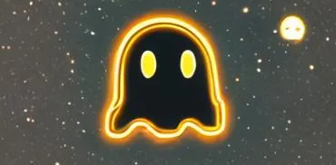

<!-- PROJECT SHIELDS -->
[![Contributors][contributors-shield]][contributors-url]
[![Forks][forks-shield]][forks-url]
[![Stargazers][stars-shield]][stars-url]
[![Issues][issues-shield]][issues-url]
[![MIT License][license-shield]][license-url]
[![LinkedIn][linkedin-shield]][linkedin-url]

<!-- PROJECT LOGO -->
 

  

  <h3 align="center">Ghost Frequencies - Ghost Infinity Mirror</h3>

  

    An Arduino project for controlling the custom 14x14 Ghost Mirror screen, it's surrounding lights, and accepting input from the attached NES controller to manipulate patterns.
  

<!-- TABLE OF CONTENTS -->

  
Table of Contents

  <ol>
    <li>
      <a href="#about-the-project">About The Project</a>
      <ul>
        <li><a href="#built-with">Built With</a></li>
      </ul>
    </li>
    <li>
      <a href="#getting-started">Getting Started</a>
      <ul>
        <li><a href="#prerequisites">Prerequisites</a></li>
        <li><a href="#installation">Installation</a></li>
      </ul>
    </li>
    <li><a href="#usage">Usage</a></li>
    <li><a href="#roadmap">Roadmap</a></li>
    <li><a href="#contributing">Contributing</a></li>
    <li><a href="#license">License</a></li>
    <li><a href="#contact">Contact</a></li>
    <li><a href="#acknowledgments">Acknowledgments</a></li>
  </ol>

<!-- ABOUT THE PROJECT -->
## About The Project

![Product Image][product-image]

Ghost Frequencies runs two Ghost Cart art cars that frequent Burning Man and music festivals around the country, and attached to the front of each car is a custom infinity mirror LED screen in the shape of a PAC-MAN Ghost. This Arduino project is for the microcontroller that controls the central Ghost-shaped light screen, the outer ring of lights around it, and the NES controller input for manipulating the patterns displayed.

Main points:
* This project aims to simplify the creation and addition of new patterns for the Ghost Screen and Outer Ring lights.
* This project can be used for similar or even identical projects by others.

(<a href="#readme-top">back to top</a>)

### Built With

* [![Arduino][Arduino]][Arduino-url]
* [![Neopixel][Neopixel]][Neopixel-url]

(<a href="#readme-top">back to top</a>)

<!-- GETTING STARTED -->
## Getting Started

Instructions to come soon... have to finalize the design first

### Prerequisites

(<a href="#readme-top">back to top</a>)

<!-- USAGE EXAMPLES -->
## Usage

Anyone wanting to interact with this project should have some experience with Arduino programming, or at least some knowledge of microcontroller work or C++.

This project can be downloaded and ran on the Arduino framework. It is specifically designed with a Mega 2560 in mind, but you may be able to adapt it to other boards.

(<a href="#readme-top">back to top</a>)

<!-- ROADMAP -->
## Roadmap

- [x] Control multiple LED groups separately for the Ghost Screen and Outer Ring
- [x] Take in NES controller input to switch patterns on each individual screen
- [ ] Alter the LED_Screen class to handle 2D screens with masking
- [ ] Alter all patterns to be able to be passed an LED_Screen class reference to standardize them
- [ ] Add a version of Tetris on the 14x14 screen

See the [open issues](https://github.com/DrewBanyai/GhostFrequencies/issues) for a full list of known issues.

(<a href="#readme-top">back to top</a>)

<!-- CONTRIBUTING -->
## Contributing

This project is currenly open in the sense that it is free to download and alter, but if you'd like to contribute, there currently isn't any system in place for requesting features. Please reach out if you'd like to contribute in some way. Feel free at any time to fork the repo and create a pull request, though there are no guarantees your work will be received to the main branch.

Don't forget to give the project a star! Thanks again!

1. Fork the Project
2. Create your Feature Branch (`git checkout -b feature/AmazingFeature`)
3. Commit your Changes (`git commit -m 'Add some AmazingFeature'`)
4. Push to the Branch (`git push origin feature/AmazingFeature`)
5. Open a Pull Request

(<a href="#readme-top">back to top</a>)

<!-- LICENSE -->
## License

Distributed under the MIT License. See `LICENSE.txt` for more information.

(<a href="#readme-top">back to top</a>)

<!-- CONTACT -->
## Contact

Drew Banyai - [@DrewBearsItAll](https://twitter.com/DrewBearsItAll) - DrewBanyai@gmail.com

Project Link: [https://github.com/DrewBanyai/GhostFrequencies](https://github.com/DrewBanyai/GhostFrequencies)

(<a href="#readme-top">back to top</a>)

<!-- ACKNOWLEDGMENTS -->
## Acknowledgments

Thanks to the Ghost Frequencies crew for working with me on this project!

(<a href="#readme-top">back to top</a>)

<!-- MARKDOWN LINKS & IMAGES -->
<!-- https://www.markdownguide.org/basic-syntax/#reference-style-links -->
[contributors-shield]: https://img.shields.io/badge/contributors-1-blue
[forks-shield]: https://img.shields.io/badge/forks-0-purple
[stars-shield]: https://img.shields.io/badge/stars-0-gold
[issues-shield]: https://img.shields.io/badge/issues-0-black
[license-shield]: https://img.shields.io/badge/license-MIT-darkgreen
[linkedin-shield]: https://img.shields.io/badge/linkedin-0072b1

[contributors-url]: https://github.com/DrewBanyai/GhostFrequencies/graphs/contributors
[forks-url]: https://github.com/DrewBanyai/GhostFrequencies/network/members
[stars-url]: https://github.com/DrewBanyai/GhostFrequencies/stargazers
[issues-url]: https://github.com/DrewBanyai/GhostFrequencies/issues
[license-url]: https://github.com/othneildrew/Best-README-Template/blob/master/LICENSE.txt
[linkedin-url]: https://www.linkedin.com/in/drewbanyai/

[product-image]: https://raw.githubusercontent.com/DrewBanyai/GhostFrequencies/main/Ghost%20Cart/GhostInfinityMirror/Documentation/ProjectImage.png

[Arduino]: https://raw.githubusercontent.com/DrewBanyai/GhostFrequencies/main/Ghost%20Cart/GhostInfinityMirror/Documentation/ArduinoLogoRound.png
[Arduino-url]: https://https://arduino.cc//
[Neopixel]: https://raw.githubusercontent.com/DrewBanyai/GhostFrequencies/main/Ghost%20Cart/GhostInfinityMirror/Documentation/NeopixelLogo.png
[Neopixel-url]: https://www.adafruit.com/category/168
